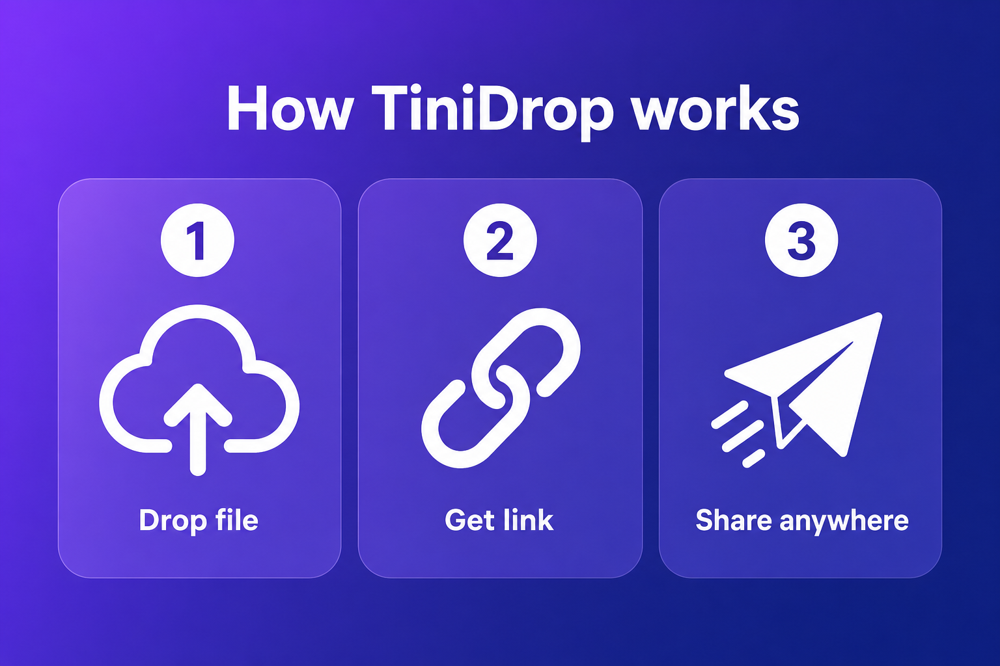
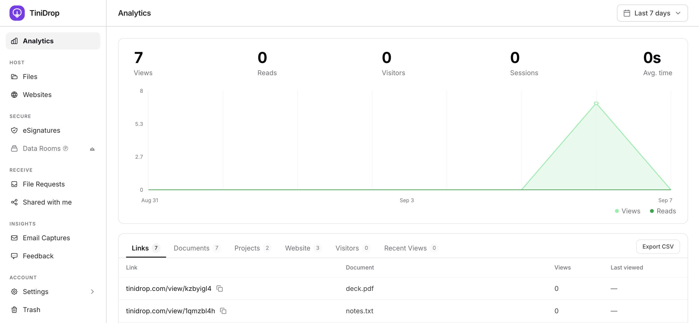
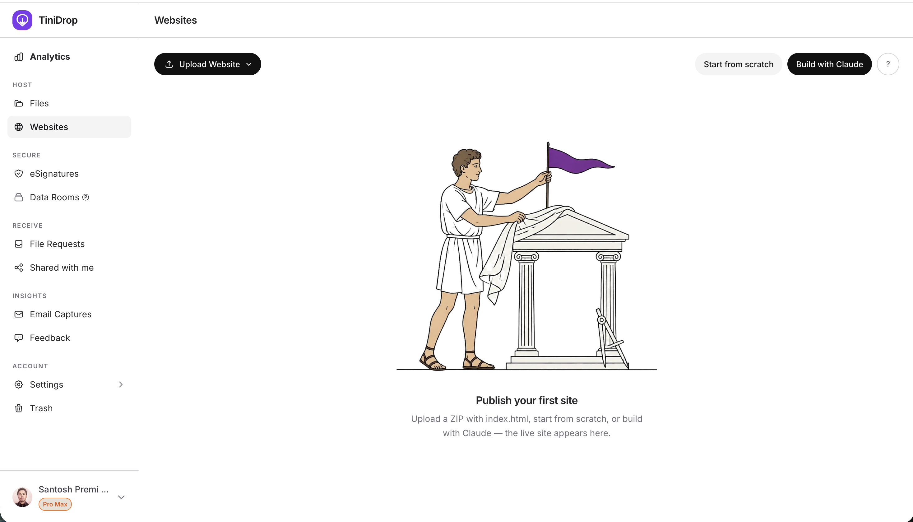
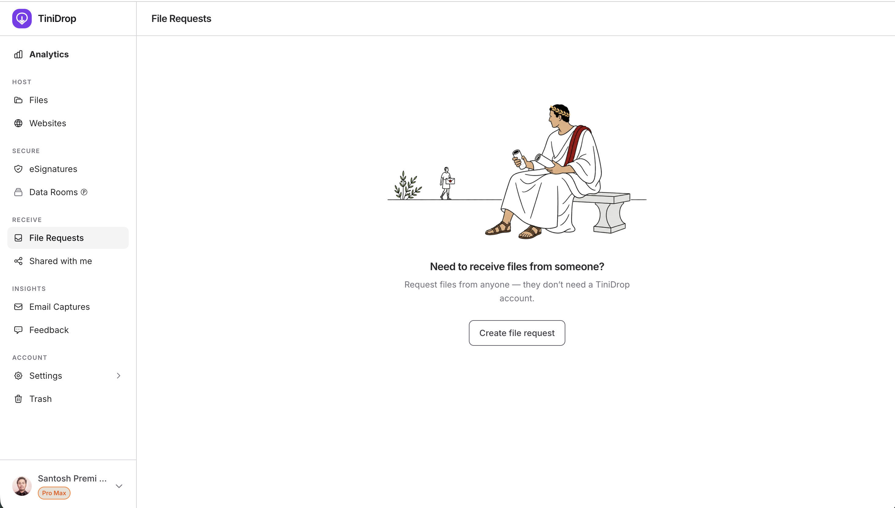
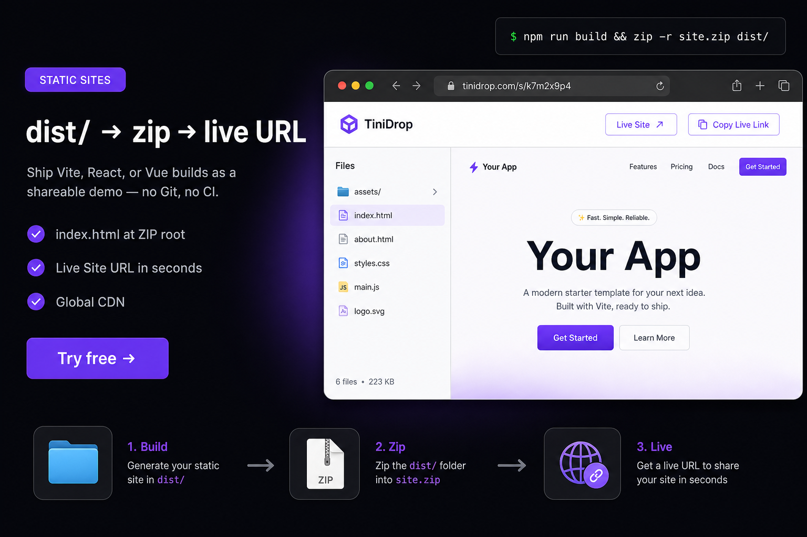

<div align="center">
  

  <h1>TiniDrop</h1>

  <p><strong>Send proposals. Track every read. Close faster.</strong></p>

  <p>Share pitch decks, sites, and contracts as a link. Know who opened it, which pages they read, and when to follow up.</p>

  <p>
    <a href="https://tinidrop.com"></a>
    <a href="https://tinidrop.com/pricing"></a>
    <a href="https://linkedin.com/company/tinidrop"></a>
  </p>

  <p>
    
    
    
    
    
    
    
  </p>

  <br />
  
</div>

<br />

<div align="center">
  
</div>

---

## Product

TiniDrop is a document-intelligence platform: upload a file or a static site, get a professional link, then see how it was viewed.

| | |
| --- | --- |
| **App** | [tinidrop.com](https://tinidrop.com) |
| **HQ** | Germany |
| **Languages** | English, Spanish, Portuguese, German, French, Arabic, Japanese |
| **Plans** | Free · Starter · Solo · Pro · Pro Max |

**Host**
- Pitch decks, PDFs, images, and folders as a branded link
- Static websites from ZIP / HTML (`index.html`)
- Custom domains, vanity slugs, and QR codes

**Secure**
- Password, NDA gates, view-only, and watermarks
- eSignatures (single-party and multi-party)
- Data rooms for diligence and investor sharing

**Know**
- Who opened the link, which pages they read, time on page
- View notifications, email capture, and exportable analytics

**Receive**
- File requests (the other person does not need an account)
- Shared-with-me inbox and team workspaces on higher plans

<div align="center">
  
</div>

---

## Product surfaces

<table>
  <tr>
    <td width="50%"></td>
    <td width="50%"></td>
  </tr>
  <tr>
    <td></td>
    <td></td>
  </tr>
</table>

---

## Open source

The product itself is private. These public repos are the company surface on GitHub.

| Repo | What it is |
| --- | --- |
| [**TiniDrop**](https://github.com/TiniDrop/TiniDrop) | Company profile |
| [**cli**](https://github.com/TiniDrop/cli) | Deploy files and sites from the terminal |
| [**brand**](https://github.com/TiniDrop/brand) | Logo, color, and press kit |
| [**templates**](https://github.com/TiniDrop/templates) | ZIP-ready HTML site templates |
| [**examples**](https://github.com/TiniDrop/examples) | Sample sites you can upload |
| [**security**](https://github.com/TiniDrop/security) | Vulnerability disclosure |

```bash
# Deploy a folder or file (Solo+ API key)
npx github:TiniDrop/cli deploy ./dist
```

---

## Stack

Built for global latency and simple ops: **Next.js**, **Cloudflare Pages + R2**, **Supabase**, **Stripe**.

---

## Contact

| | |
| --- | --- |
| Product | [tinidrop.com](https://tinidrop.com) |
| Sales & press | [hello@tinidrop.com](mailto:hello@tinidrop.com) |
| Security | [hello@tinidrop.com](mailto:hello@tinidrop.com) — see [security](https://github.com/TiniDrop/security) |
| LinkedIn | [linkedin.com/company/tinidrop](https://linkedin.com/company/tinidrop) |

<p align="center"><sub>© TiniDrop · Germany · <a href="https://tinidrop.com">tinidrop.com</a></sub></p>
