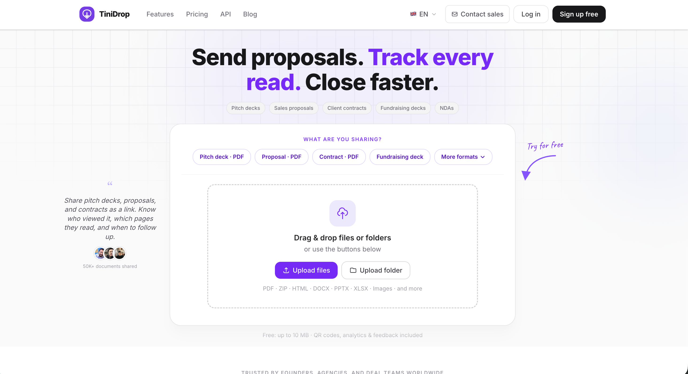
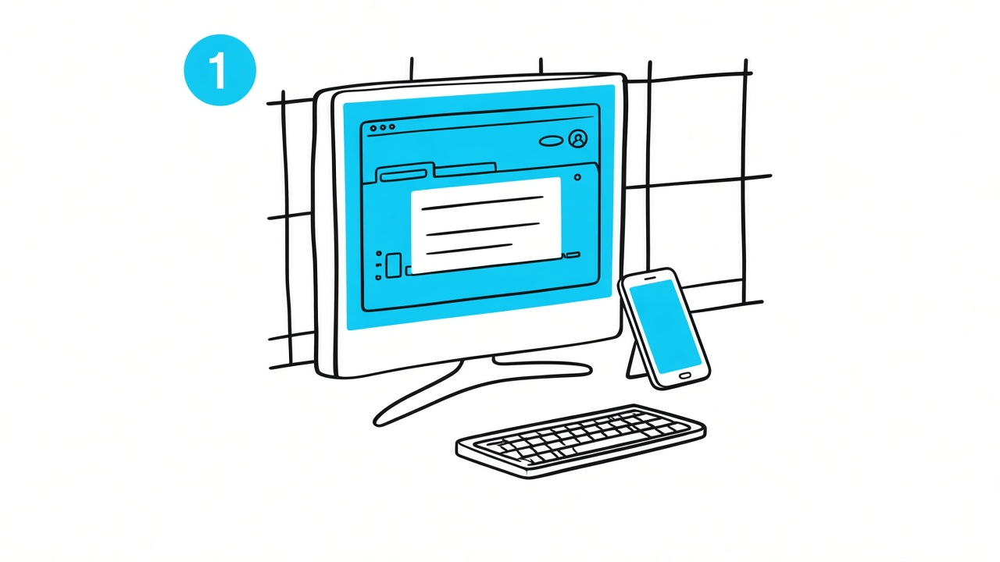

# TiniDrop

Share files, track views, collect signatures.

TiniDrop is for founders, freelancers, sales teams, and agencies who send a deck or a contract and then sit in the dark. You drop a PDF, a pitch deck, a proposal, a contract, a ZIP, or an HTML file. You get a link. Then you see who opened it, which pages they stayed on, and when it is worth following up.

**[tinidrop.com](https://tinidrop.com)** · Germany · English, Spanish, Portuguese, German, French, Arabic, Japanese

  

## Share a file as a link

PDFs, decks, proposals, contracts, and images open in the browser. Recipients do not have to download anything or create an account. Folders upload as a set of files. HTML and ZIP with `index.html` become a live site on `*.tinidrop.app` (custom domain on paid plans).

  

## See who opened it

View counts are on Free. Paid plans add who opened the link, when, and an email when they come back. Pro adds time on each page, so you know whether they skimmed slide 1 or actually read the pricing.

  

## Signatures, NDAs, and locks

Solo can require a signature before the file opens. Pro adds multi-party signing and an NDA gate. Password, view-only, watermark, email capture, and screenshot protection sit on the same link — you turn them on per file, not as a separate product.

  

## Sites, data rooms, automation

A ZIP of a Vite or static build is a hosted demo: HTTPS, no Git, no CI. Pro Max adds data rooms (groups, Q&A, audit log, deal tasks) for diligence. Solo and above get an API, webhooks, and file-request links so the other person can send you a file without an account. There is a [CLI](https://github.com/TiniDrop/cli) and [API docs](https://tinidrop.com/api-docs).

## Pricing

Numbers below are monthly, from the live product. Yearly billing is on the site. No card for Free.

| Plan | Price | Fit |
| --- | --- | --- |
| **Free** | $0 | 5 MB per file, 1 file + 1 website, 30-day links, QR, view counts, in-browser PDF/HTML |
| **Starter** | $7 | Permanent links, no TiniDrop branding, 25 MB, who viewed, email alerts, custom domain |
| **Solo** | $15 | Password, disable download, eSign gate, vanity slug, API, webhooks, file requests, 75 MB |
| **Pro** | $35 | Page analytics, NDA, watermark, multi-party eSign, email capture, 5 team seats |
| **Pro Max** | $99 | Data rooms, audit log, Q&A, screenshot protection, larger files and storage |

[Full comparison](https://tinidrop.com/pricing)

## Public repos

The product itself is private. These are the public pieces.

| Repo | |
| --- | --- |
| [TiniDrop](https://github.com/TiniDrop/TiniDrop) | This profile |
| [cli](https://github.com/TiniDrop/cli) | `tinidrop deploy ./dist` |
| [brand](https://github.com/TiniDrop/brand) | Logo and colour |
| [templates](https://github.com/TiniDrop/templates) | HTML you can zip and host |
| [examples](https://github.com/TiniDrop/examples) | Sweet Delights site and a sample NDA |
| [security](https://github.com/TiniDrop/security) | How to report a vulnerability |

## Contact

[hello@tinidrop.com](mailto:hello@tinidrop.com) · [tinidrop.com](https://tinidrop.com) · [API](https://tinidrop.com/api-docs) · [LinkedIn](https://linkedin.com/company/tinidrop)
